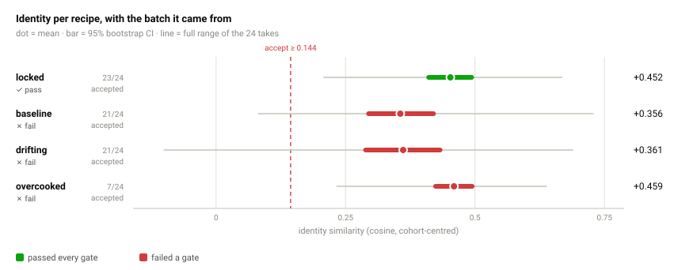
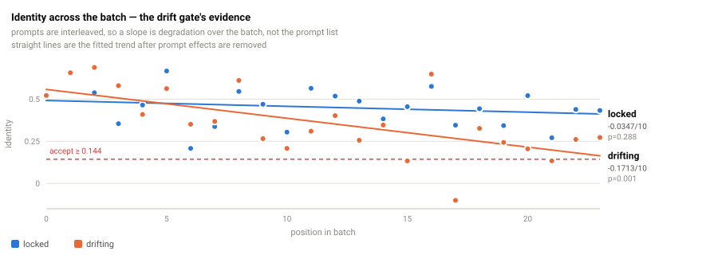
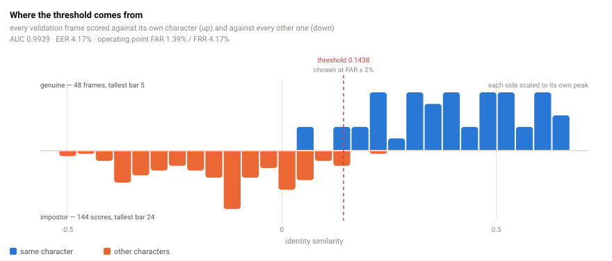
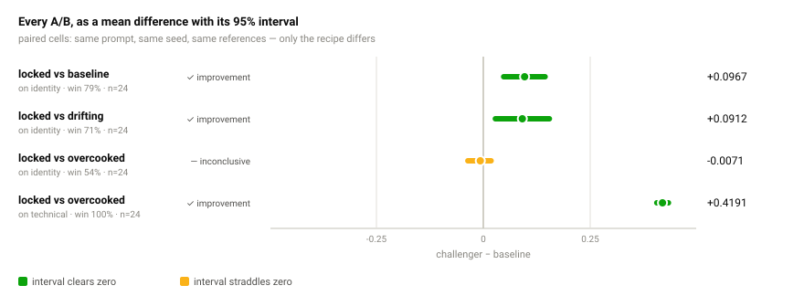
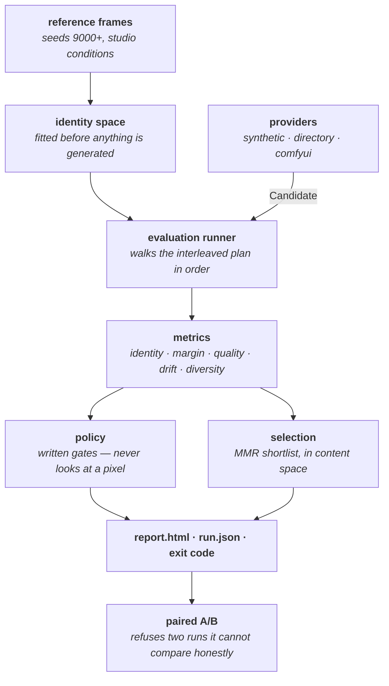
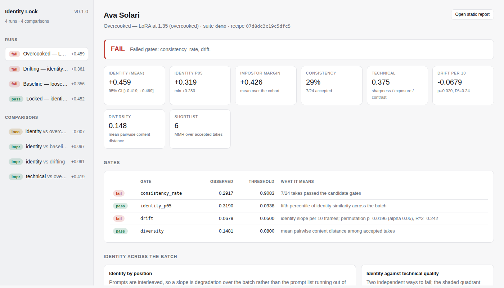

<h1 align="center">Identity Lock</h1>

<p align="center">
  <b>Does your generation pipeline actually keep the character on-model — and can you prove it?</b>
</p>

<p align="center">
  
  
  
  
  
  
  
</p>

Identity Lock renders or ingests a batch of frames, measures how far each one sits
from a character's reference set, decides whether the batch passes a written
policy, and leaves behind a report, a machine-readable result and an exit code.

It answers the question a review meeting always ends on — *"is v2 of the LoRA
better than v1?"* — with a number and a confidence interval instead of four
cherry-picked screenshots.

```bash
make demo        # ~40s, no GPU, no model weights, no network
make serve       # dashboard at http://127.0.0.1:8420
```

---

## The demo, in one picture

Four recipes, one character, 24 frames each. Every figure below is generated from
the run data by [`scripts/render_readme_charts.py`](scripts/render_readme_charts.py) —
`make charts` regenerates them, so a number here that stops matching the code is a
diff, not a discovery.

<picture>
  <source media="(prefers-color-scheme: dark)" srcset="docs/assets/verdicts-dark.svg">
  <source media="(prefers-color-scheme: light)" srcset="docs/assets/verdicts-light.svg">
  
</picture>

| Recipe | Verdict | identity (95% CI) | accepted | drift /10 frames | Failed gates |
| --- | --- | --- | --- | --- | --- |
| `locked` — identity LoRA at 0.85 | **pass** | +0.452 [+0.406, +0.498] | 23/24 | −0.035 (p=0.29) | — |
| `baseline` — loose identity | **fail** | +0.356 [+0.290, +0.424] | 21/24 | −0.115 (p=0.02) | `consistency_rate`, `drift` |
| `drifting` — identity slides | **fail** | +0.361 [+0.284, +0.437] | 21/24 | −0.171 (p=0.001) | `consistency_rate`, `drift` |
| `overcooked` — LoRA at 1.35 | **fail** | +0.459 [+0.419, +0.499] | 7/24 | −0.068 (p=0.02) | `consistency_rate` |

**`overcooked` has the best identity numbers in the table and still fails.** Its
frames are blurred and blown out, and identity is not the only way to be unusable.
That separation is the point of the whole tool.

---

## The problem

An AI influencer is a character that has to survive a thousand frames. The failure
modes are specific and none of them are visible one image at a time:

| Failure | What it looks like |
| --- | --- |
| **Identity drift** | frame 40 is subtly not the same person as frame 1 |
| **Off-model takes** | one frame in eight lands closer to somebody else |
| **Silent regressions** | a new LoRA weight helps four shots and quietly breaks twenty |
| **Sameness** | the pipeline holds the character perfectly — by producing one photograph |

The usual quality process is a person scrolling a contact sheet. That does not
scale, does not reproduce, does not gate a release, and cannot tell you whether a
change was an improvement or noise.

---

## Drift, and the confound almost everyone measures instead

The first implementation of the drift gate fired on a batch with no drift in it.
The cause was the experiment design, not the statistic: the plan iterated
prompt-major, so the hardest prompt sat at the end of every batch and *position*
was perfectly aliased with *prompt difficulty*. The slope was measuring the order
of the prompt list.

<picture>
  <source media="(prefers-color-scheme: dark)" srcset="docs/assets/drift-dark.svg">
  <source media="(prefers-color-scheme: light)" srcset="docs/assets/drift-light.svg">
  
</picture>

Three changes, all needed ([ADR-0005](docs/adr/0005-drift-as-a-stratified-permutation-test.md)):

```text
prompt-major   A A A A A A  B B B B B B  C C C C C C   ← position ≡ prompt difficulty
seed-major     A B C D  A B C D  A B C D  A B C D      ← what the plan actually does
```

1. **Interleaved plan** — every prompt once, then every prompt again with the next seed.
2. **Group centring** — each prompt's mean is removed before the slope is fitted.
3. **Stratified permutation null** — the null reshuffles *within* each prompt, never
   across, so the p-value asks exactly one question: is this ordering steeper than chance?

The gate then requires **both** practical and statistical significance —
`|slope| > drift_abs_max` **and** `p < drift_alpha`. With enough frames a slope of
0.001 becomes significant and still means nothing.

---

## Where the thresholds come from

A gate written as `identity >= 0.72` is worthless unless somebody can say where
0.72 came from. Here it comes from a labelled validation set and an ROC curve —
the standard face-verification answer.

<picture>
  <source media="(prefers-color-scheme: dark)" srcset="docs/assets/verification-dark.svg">
  <source media="(prefers-color-scheme: light)" srcset="docs/assets/verification-light.svg">
  
</picture>

```console
$ identitylock calibrate --suite suites/demo.yaml --write

  character  refs  coherence  loo mean  impostor  separation
  ava           8     0.7505    0.8469    0.1562      0.6907
  mira          8     0.8311    0.8988   -0.1927      1.0916
  noor          8     0.6538    0.7801    0.1548      0.6253
  kai           8     0.8764    0.9270   -0.0896      1.0166

  verification AUC 0.9939   EER 4.17% at +0.1210
  operating point: FAR target 2.0% -> achieved 1.39%, FRR 4.17%

  warning  2/48 validation frames sit closer to another character than to their
           own. Those are descriptor failures, not generation failures.
```

Three seed ranges, deliberately disjoint, so no threshold is ever fitted on the
frames it will later judge:

| Frames | Seeds | Role |
| --- | --- | --- |
| **reference** | `9000+` | the yardstick — studio conditions, no jitter |
| **validation** | `7000+` | where the threshold comes from — production-like |
| **evaluation** | the suite | what actually gets judged |

`technical_min`, `drift_abs_max`, `drift_alpha` and `diversity_min` are **not**
derived. They are product decisions, written in the suite file next to a comment
saying what each one asserts, so a reviewer can argue with them.

---

## Reading an A/B

Every cell is the same prompt and the same seed under two recipes, so the
difference cannot be explained by "it drew a different picture".

<picture>
  <source media="(prefers-color-scheme: dark)" srcset="docs/assets/comparisons-dark.svg">
  <source media="(prefers-color-scheme: light)" srcset="docs/assets/comparisons-light.svg">
  
</picture>

The third row is the one worth looking at. `locked` and `overcooked` hold the
character **equally well** — on `identity` the interval straddles zero and the tool
says *inconclusive*. The same pair of runs is a 100% win on `technical`. A harness
that cannot say "not enough evidence" is not measuring anything.

```
regression   ⟺  ci_high < 0
improvement  ⟺  ci_low > 0  ∧  win_rate ≥ min  ∧  |effect| ≥ min  ∧  mean δ > 0
otherwise    inconclusive
```

The confidence interval is the arbiter, not the mean.

---

## What it measures

Every number has a published formula in [docs/metrics.md](docs/metrics.md).

| Measure | What it answers |
| --- | --- |
| **identity similarity** | How close is this frame to the character's reference centroid? |
| **impostor margin** | …and how much closer than to the *nearest other character*? |
| **nearest reference** | Does it match one reference closely while missing the average? |
| **technical score** | Sharpness, exposure, contrast, clipping — is the frame publishable? |
| **drift** | Does identity slide as the batch progresses, more than by chance? |
| **diversity** | Do the accepted takes actually differ from each other? |
| **consistency rate** | What share of the batch cleared every candidate gate? |

Two design decisions carry most of the weight:

**Identity and content are separate vectors.** Identity consistency alone is
trivially maximised by generating the same frame every time. Measuring "is this the
same character" on one vector and "is this a different picture" on another lets a
policy demand both at once — and lets the shortlist penalise duplicates without ever
rewarding a take for drifting off-model. ([ADR-0001](docs/adr/0001-two-vectors-identity-and-content.md))

**The margin, not the similarity, is the falsifiable claim.** A cosine of 0.9 means
nothing on its own; if every character in the cohort scores 0.9 against a frame, the
descriptor is measuring "a portrait", not "this portrait". A cohort of one produces
`None` and a skipped gate — never a silent pass. ([ADR-0003](docs/adr/0003-impostor-margin.md))

---

## Architecture



One direction of dependency, enforced by the import graph:
`domain ← imaging / embeddings ← metrics ← selection ← evaluation → reporting / api / cli`.

Four rules shape everything else:

1. **The evaluation layer never talks to a model.** It asks a provider for a
   candidate and gets a file plus the inputs that produced it. Swapping a procedural
   renderer for a remote GPU changes one flag.
2. **The policy never looks at an image.** It applies written rules to numbers that
   are already measured, so an archived run can be re-judged under a new policy
   without regenerating anything.
3. **Recipes are content-addressed, not edited.** `revision` is derived from the
   fields that change what comes out of the model, and recomputed on load — a report
   cannot claim a revision its own fields do not produce.
4. **A comparison that cannot be honest refuses to run.** Different suites,
   characters, embedders or reference sets, mismatched cells, or the same recipe on
   both sides: errors, not warnings.

Details in [docs/architecture.md](docs/architecture.md) and the eight [ADRs](docs/adr/).

---

## Two surfaces

**A self-contained HTML report** per run — images inlined as data URIs, charts as
hand-written inline SVG, no scripts and no network. It survives being emailed,
attached to a ticket, or opened from a USB stick two years from now.

**A read-only dashboard** (`identitylock serve`) for iterating across runs. It never
generates, scores or mutates, and it recomputes nothing — every number it shows is
the number stored in `run.json`, so it and the report can never disagree.

<p align="center">
  
</p>

---

## Bringing your own images

The synthetic renderer exists so the demo is real without a GPU. Nothing else in
the harness knows about it.

```bash
# Frames you generated elsewhere — name them <character>.<prompt>.<seed>.png
identitylock run --suite my-suite.yaml --recipe v3 \
  --provider directory --images ./renders --gate

# Straight from a ComfyUI box
identitylock run --suite my-suite.yaml --recipe krea2-lora-v3 \
  --provider comfyui --comfyui http://comfyui.local:8188 \
  --workflow suites/workflows/portrait.api.json
```

See [docs/comfyui.md](docs/comfyui.md) for the workflow contract, and swap the
descriptor with `--embedder clip` or `--embedder arcface` once the extra is installed.

---

## Quality gates

| Gate | Result |
| --- | --- |
| `ruff check` | clean |
| `ruff format --check` | 65 files formatted |
| `mypy --strict` | no issues in 52 source files |
| `pytest` | **295 passed**, 1 skipped, in ~45 s |
| coverage | **95%** overall |
| `tsc --noEmit` | clean (dashboard, `strict` + `noUncheckedIndexedAccess`) |
| `vite build` | 209 kB bundle, no runtime dependency beyond React |
| `identitylock demo` | end to end in ~40 s on a laptop CPU |

CI additionally asserts that **the harness still works**: the locked recipe must
pass its gates and the loose one must still be caught. A monitoring tool that
silently stops detecting anything is worse than no tool.

---

## Known limitations

Stated plainly, because a reader would otherwise assume otherwise.

- **The default descriptor is classical, not learned.** Oriented gradients, LBP
  texture and saturation-weighted hue — a real measurement of the pixels, but not a
  face-recognition embedding. It separates characters whose structure and palette
  differ; it will not tell two similar faces apart. On the bundled cohort it reaches
  AUC 0.994 and still misplaces 2 of 48 validation frames. Use `--embedder arcface`
  for production identity numbers.
- **The learned backends' weights cannot be fetched here, so inference is unrun.**
  `torch` and `open_clip` install from PyPI and import cleanly, but this
  environment's network policy denies `huggingface.co` and `download.pytorch.org`,
  so `--embedder clip` gets as far as building the model and then fails on the
  download. What *is* tested is the wiring around the model, which is where a
  silent bug would live: that identity is read from the centre crop and content
  from the whole frame, that both vectors come out normalised, that the largest
  detected face wins and a zero-area or inverted box never does, and that a frame
  with no detected face is scored as a zero vector of the declared dimension —
  rejected by the gate, counted in `misses`, and reported — rather than as a
  descriptor from a different space. Coverage there is 73%; what remains uncovered
  is the model call itself.
- **The ComfyUI adapter has never met a live ComfyUI here.** Its placeholder
  substitution and output selection are tested; its HTTP paths are not (49% covered).
- **The demo characters are procedurally rendered, not generated.** The provider is
  a deterministic simulator of a generation stack, not a generative model. Every
  metric in the demo is computed from real pixels — but they are simple pixels.
- **Thresholds transfer no further than the calibration set.** Change the embedder,
  the cohort, the reference conditions or the render pipeline and re-run
  `identitylock calibrate`. The shipped numbers are correct for the bundled demo
  and for nothing else.
- **The bootstrap uses the percentile method, not BCa.** Fine for the near-symmetric
  paired differences it is applied to; say so rather than assume it for a skewed
  statistic.

---

## Ethics and disclosure

This tool is built for **openly virtual characters**. Every character carries a
disclosure string that travels into every report, and the demo characters are
procedurally generated and depict no real person.

Identity Lock measures whether generated frames match *a reference set you supply*.
It is not a face-recognition system, it has no feature for identifying a person, and
nothing here should be pointed at a real individual's likeness without their consent.
A passing run says a batch cleared the stated gates. It is not a statement about
resemblance to any real person, and no gate here checks that.

---

## Repository layout

```
identity-lock/
  src/identitylock/
    domain/        immutable models + the acceptance policy
    imaging/       loading and frame measurement (numpy + pillow only)
    embeddings/    the descriptor protocol; classical default, learned optional
    metrics/       statistics, identity space, calibration, diversity
    selection/     MMR shortlisting
    evaluation/    suites, the runner, A/B regression, the on-disk store
    reporting/     self-contained HTML + inline SVG charts
    api/           read-only FastAPI + the built dashboard
    cli.py
  web/             Vite + React dashboard (source for api/static)
  scripts/         the README chart renderer
  suites/          declarative evaluation suites + a ComfyUI workflow template
  tests/           295 tests
  docs/            metrics, protocol, architecture, ADRs, generated figures
```

## Documentation

| Document | Contents |
| --- | --- |
| [docs/metrics.md](docs/metrics.md) | every formula, every constant, and why each one is shaped so |
| [docs/evaluation-protocol.md](docs/evaluation-protocol.md) | how to run an evaluation that means something |
| [docs/architecture.md](docs/architecture.md) | layers, data flow, the on-disk contract |
| [docs/comfyui.md](docs/comfyui.md) | wiring a real GPU box in, and the workflow template contract |
| [docs/adr/](docs/adr/) | the eight decisions that shaped the rest |

---

<p align="center">
  <sub>MIT. Built as a standalone project — it does not import from, or get imported by,<br/>
  anything else in this repository.</sub>
</p>
